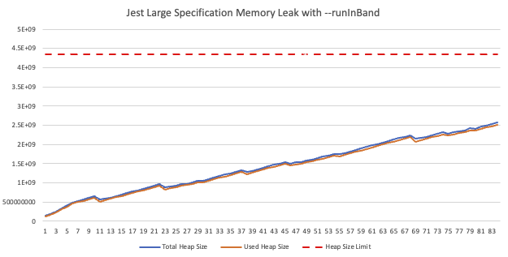
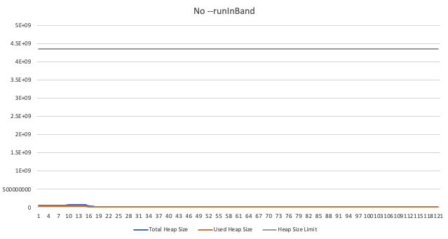
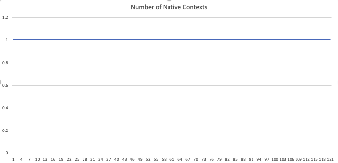

# Jest --runInBand memory leak

This repo provides an overview of a consistently reproducible memory leak
involving `jest`, `--runInBand` and (sometimes) `jsdom`

## getting started

Run the following commands to set up the repro project:

1. `nvm use`
1. `npm install`
1. `npm run generate-test-cases`

## jsdom, and native contexts

<figure>
    
    <figcaption>
        Observe a linearly increasing heap size. Allowed to continue the process will crash with a Heap OOM
    </figcaption>
</figure>

It was observed in a repo at scale, jest is leaking memory in ci during test runs.

To reproduce this result locally, run:

1. `npm run test-oom`

This will produce a csv file that monitors several interesting properties related to the javascript heap and vm.

Notice that this is due to stale native contexts not being garbage collected:

<figure>

<figcaption>
    Native contexts linearly increasing, each retaining a `jsdom` `Window` object
</figcaption>
</figure>

However, when compared to the results of a process not run in band the process exhibits expected behavior:

1. `npx jest --testEnvironment=jsdom  --no-cache --testPathPattern=./tests-leak`

| <figure     >      <figcaption>      When specifications are run in parallel, the test runner does not leak memory.  </figcaption>   </figure> | <figure>      <figcaption>      We see here that Native Contexts are being properly garbage collected over time.  </figcaption>   </figure> |
|---------------------------------------------------------------------------------------------------------------------------------------------------------------------------------------------------------------------|---------------------------------------------------------------------------------------------------------------------------------------------------------------------------------------------------------------------|

## regex literals, v8 parsing

There is a known v8 bug (see [issue 10441](https://bugs.chromium.org/p/v8/issues/detail?id=10441) and [issue 11069](https://bugs.chromium.org/p/v8/issues/detail?id=11069)) that will cause a Heap Out of Memory error to occur, even when the process in question has not exceeded the max heap size.

While the above case indicated that the issue may lie within jest-environment-jsdom, we can trigger an interesting result with the node environment.

To demonstrate this failure mode run the following command:

1. `npm run test-regex-oom`

This will eventually trigger the Regex OOM error highlighted in the above v8 bug reports. There are a few interesting things
about this failure:

* Performance of each specification degrades what seems linearly with the number of specifications that are run
* Rerunning an individual specification that triggered the OOM error will never produce the result. The whole suite must be run
* Running this same experiment without `--runInBand` generally does not trigger this error
* The regex's are created _within_ the `describe` block.

This points towards there being some shared state in the `--runInBand` mode at the test runner level, outside of `jest-environment-jsdom`

*note*

This particular bug is patched in V8 v10.x, which ships with Node 18. Node 16.x ships with V8 9.3.x-9.4.x which exhibits varying degrees of failures.